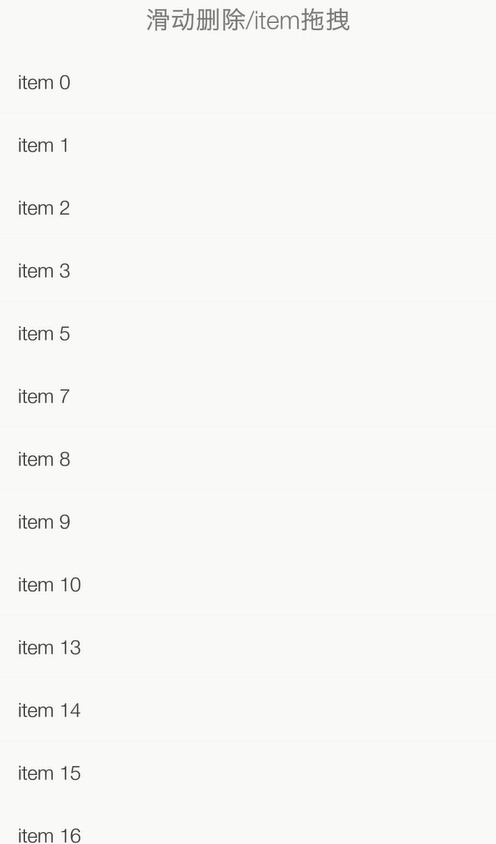

# MyApplication

整合Android一些常用的控件

* 横向滑动选择按钮

* 更换语言

* 图片列表/多图预览

* 日历

* 清理缓存

* 开启动画/带提示输入框

* 下拉菜单

* 滑动返回

* 消息小红点

* 点赞效果

* 刷新加载(ListView)

* 简单的侧滑功能(RecyclerView)

* 滑动删除/item拖拽

* 仿IOS开关按钮

